<div align="center">

<picture>
  <source media="(prefers-color-scheme: dark)" srcset="./assets/hero-dark.svg">
  <source media="(prefers-color-scheme: light)" srcset="./assets/hero-light.svg">
  
</picture>

<br>

<picture>
  <source media="(prefers-color-scheme: dark)" srcset="https://readme-typing-svg.demolab.com/?font=Fira+Code&weight=600&size=20&duration=2800&pause=900&color=58A6FF&center=true&vCenter=true&width=760&height=44&lines=Local-first+AI+systems+that+run+on+hardware+you+own;Cameras+%E2%86%92+evidence-carrying+incidents;Agents+that+propose%2C+policies+that+decide%2C+humans+that+approve;From+problem+to+production%2C+end+to+end">
  
</picture>

<br>

<a href="https://github.com/haidar-farhat?tab=repositories"></a>
<a href="https://www.linkedin.com/in/haydar-farhat7"></a>
<a href="#-lets-build-something"></a>

<br><br>


</div>

<br>

<table>
<tr>
<td width="58%" valign="top">

## `$ whoami`

I'm an **AI engineer and full-stack software engineer** who builds the *whole* system: computer vision and geospatial intelligence, LLM agents and retrieval, the backend and interface around them, and the automation that keeps it running.

The thread through everything I ship:

- **Local-first.** Runs on hardware you own. No cloud dependency, no data leaving the machine.
- **Evidence-carrying.** Every conclusion carries the frames, the rule, the model and the number behind it.
- **Human-in-the-loop.** The model proposes, plain code decides, a person approves anything that matters.

> **AI is the component. The product is the system.**

</td>
<td width="42%" valign="top">

## `$ cat focus.txt`

```text
Computer vision       ████████████████████
Geospatial AI         ███████████████████░
LLM agents & RAG      ████████████████████
Browser automation    ██████████████████░░
Local GPU inference   ███████████████████░
Full-stack products   ████████████████████
Rust + GPU compute    ████████████████░░░░
```

```text
now      : multi-camera incident intelligence
stack    : Python · Rust · TypeScript · PHP
serving  : ONNX Runtime · Ollama · LM Studio
ask me   : vision-to-map geometry, agent safety,
           RAG on small local models
```

</td>
</tr>
</table>

<br>

## 🧭 What I Build

<table>
<tr>
<td width="25%" valign="top">

### 👁️ Vision & Geospatial

Detection · segmentation · tracking

Camera-to-map geometry with error bounds

Multi-camera fusion into single incidents

OCR & document extraction

Local GPU / DirectML inference

</td>
<td width="25%" valign="top">

### 🤖 LLM Systems

AI agents with tool use

Hybrid & agentic RAG

Structured outputs

Embeddings & vector search

Small-model-friendly pipelines

</td>
<td width="25%" valign="top">

### ⚙️ Automation

Playwright browser agents

Observe → reason → policy → execute

Prompt-injection-resistant design

Workflow orchestration & state machines

Execution monitoring

</td>
<td width="25%" valign="top">

### 🌐 Product Engineering

Web, mobile & desktop apps

REST APIs & data modelling

Django · Laravel · Node

React · Angular · React Native · Flutter

Docker · CI/CD · Linux

</td>
</tr>
</table>

<br>

## 🚀 Featured Builds

<table>
<tr>
<td width="50%" valign="top">

### 🛰️ Sentinel Vision · `VIGIL`

**Local-first multi-camera security & situational awareness**

Turns ordinary cameras into a small number of *reviewable incidents*, each carrying the evidence that produced it. Three cameras seeing the same person produce **one** incident, not three alerts. Every distance is printed with its error. Runs with the Internet disconnected, and a test proves it.

`Python` `Rust core (C ABI)` `YOLOv8-seg` `ONNX Runtime` `DirectML` `Geospatial`

<a href="https://github.com/haidar-farhat/V.I.G.I.L._Vision_Intelligence_and_Geospatial_Incident_Layer"></a>


</td>
<td width="50%" valign="top">

### 🧾 LocalApply · `jobbler`

**Autonomous job-application workstation, on your machine**

Finds postings, scores them against your real CV, writes documents that only claim what you can back, then a browser agent fills the forms. The LLM never sees a selector: it picks from opaque element refs, so a prompt-injected page has no vocabulary to hijack it. Dry-run by default, 600+ tests.

`Python` `Playwright` `Local LLM (Ollama)` `Policy engine` `State machine`

<a href="https://github.com/haidar-farhat/jobbler"></a>


</td>
</tr>
<tr>
<td width="50%" valign="top">

### 📚 Brevet-GPT

**Trilingual local RAG study assistant**

A fully local, retrieval-augmented tutor for the Lebanese Brevet curriculum. Students ask in **English, French or Arabic**; answers are grounded strictly in the official textbooks with citations. Hybrid dense + lexical retrieval, agentic route → retrieve → rerank → grade → verify with a hard LLM-call budget, and an OCR ingestion UI for growing the corpus.

`Django ASGI` `Angular` `ChromaDB` `bge-m3` `LM Studio` `OCR`

<a href="https://github.com/haidar-farhat/Brevet-gpt"></a>


</td>
<td width="50%" valign="top">

### 🎞️ Nu Scaler

**Offline GPU image & video upscaler + frame interpolation**

A Rust core running WGPU shaders does the heavy lifting; a PySide6 interface keeps it approachable. Built for gamers, streamers and creators who want quality without cloud round-trips. Cross-platform, fully private, with a Laravel/React admin surface alongside.

`Rust` `WGPU / WGSL` `Python` `PySide6` `Laravel` `React`

<a href="https://github.com/haidar-farhat/NU_Scaler"></a>


</td>
</tr>
</table>

<details>
<summary><b>🧪 Earlier builds & experiments</b> — full-stack products that led here</summary>
<br>

| Project | What it is | Stack |
|---|---|---|
| [**PhotoMaster**](https://github.com/haidar-farhat/PhotoMaster) | Photo management & non-destructive editing desktop app with a real-time chat service (Socket.io, Redis pub/sub) | Laravel · React · Electron · Node.js · MongoDB · Docker |
| [**Sm4rt W4tch**](https://github.com/haidar-farhat/sm4rt_w4tch) | Health & activity analytics dashboard with insights and anomaly detection from a local LLM | Laravel · React/Redux · MySQL · LM Studio |
| [**EcoPay**](https://github.com/haidar-farhat/EcoPay) | Digital-payments-style platform with structured backend workflows | React · Laravel · MySQL |
| [**FAQ-AI**](https://github.com/haidar-farhat/FAQ-AI) | AI-assisted FAQ / knowledge answering | PHP · LLM integration |
| [**snip_snap**](https://github.com/haidar-farhat/snip_snap) | Web application experiment | PHP |
| **Safha Jadida** | Book-trading marketplace with accounts, listings and structured workflows | Angular · PHP · MySQL |

</details>

<br>

## 🏗️ How I Build

<picture>
  <source media="(prefers-color-scheme: dark)" srcset="./assets/pipeline-dark.svg">
  <source media="(prefers-color-scheme: light)" srcset="./assets/pipeline-light.svg">
  
</picture>

<table>
<tr>
<td width="33%" valign="top">

**🔒 Local-first by default**

Models, vector stores and inference run on the machine or the LAN. The cloud is an option, never a requirement. VIGIL ships with a test that fails if anything opens a socket to the Internet.

</td>
<td width="33%" valign="top">

**🧾 Say what you measured**

A distance is never printed without its error. A relation is never called a fact. A dismissal needs a written reason, so "dismissed" can be told apart from "nobody looked".

</td>
<td width="33%" valign="top">

**⚖️ Separate reasoning from authority**

The LLM proposes one action by reference. A policy engine in plain code allows, asks or denies. The executor does exactly that and interprets nothing.

</td>
</tr>
</table>

I care about what happens **after the demo works**: failure handling, observability, latency, data flow, maintainability, and whether the thing still solves the original problem.

<br>

## 🛠️ Stack

<div align="center">

**Languages**


**AI · Vision · Inference**


&nbsp;


**Frontend · Mobile · Desktop**


**Backend · Data**


**Infra · Tooling**


</div>

<br>

## 💼 Experience

| Role | Where | What I did |
|---|---|---|
| **Full-Stack Developer** | Carepool · healthcare coordination platform | Shipped features across frontend, Laravel/MySQL backend, database and deployment. Built operational dashboards, optimised queries, resolved production issues. |
| **Freelance Full-Stack Developer** | Fitly · cross-platform fitness app | React + TypeScript + React Native frontend, Laravel backend, and Python + Gemini API for personalised, prompt-driven recommendations. |
| **Software Engineer** | Nu Scaler · media processing | Rust core with GPU-accelerated processing, Python tooling, React/Laravel surfaces. Cross-platform optimisation on Windows and Unix. |
| **Flutter Developer** | Atwaaj Software · remote | Mobile features and reusable UI components; improved responsiveness and cross-platform UX. |
| **Python Instructor** | BrightChamps · remote | Taught Python to **100+ students** through structured lessons and hands-on projects. |
| **Network & Systems Technician** | Freelance | Network configuration, system hardening and security improvements across client environments. |

<br>

## 📊 GitHub Activity

<div align="center">

<picture>
  <source media="(prefers-color-scheme: dark)" srcset="https://github-readme-stats.vercel.app/api?username=haidar-farhat&show_icons=true&hide_border=true&theme=github_dark&bg_color=00000000&rank_icon=github&include_all_commits=true">
  
</picture>
<picture>
  <source media="(prefers-color-scheme: dark)" srcset="https://github-readme-stats.vercel.app/api/top-langs/?username=haidar-farhat&layout=compact&hide_border=true&theme=github_dark&bg_color=00000000&langs_count=8&hide=blade,html,css,batchfile,mako">
  
</picture>

<br>

<picture>
  <source media="(prefers-color-scheme: dark)" srcset="https://streak-stats.demolab.com?user=haidar-farhat&hide_border=true&theme=github-dark-blue&background=00000000">
  
</picture>

<br><br>

<picture>
  <source media="(prefers-color-scheme: dark)" srcset="https://raw.githubusercontent.com/haidar-farhat/haidar-farhat/output/github-contribution-grid-snake-dark.svg">
  <source media="(prefers-color-scheme: light)" srcset="https://raw.githubusercontent.com/haidar-farhat/haidar-farhat/output/github-contribution-grid-snake.svg">
  
</picture>

</div>

<br>

## 🎓 Background

<table>
<tr>
<td width="50%" valign="top">

**🎓 B.S. Computer Science** — Lebanese International University · 2025

**🏭 SE Factory Graduate** — intensive software engineering bootcamp · 2025

</td>
<td width="50%" valign="top">

**📜 Cisco certifications**

`CCNA` · `Cisco Network Security` · `Cisco CyberOps`

Networking and security foundations that shape how I design LAN-first, no-egress systems.

</td>
</tr>
</table>

<br>

## 🔭 Currently Exploring

<table>
<tr>
<td>🛰️</td><td><b>Multi-camera geometry</b><br>Fusing observations from several cameras into one position, with honest error ellipses</td>
<td>🧠</td><td><b>Agent safety</b><br>Opaque references, policy layers and fail-closed design for LLM-driven automation</td>
</tr>
<tr>
<td>⚡</td><td><b>Small-model RAG</b><br>Retrieval, decomposition and self-verification that hold up on 7B-class local models</td>
<td>🦀</td><td><b>Rust for AI infrastructure</b><br>Hot paths behind a C ABI, GPU compute with WGPU, safe FFI to Python</td>
</tr>
</table>

<br>

## 📬 Let's Build Something

<div align="center">

Open to collaborating on **computer vision, geospatial AI, agentic systems and local-first products**.

<a href="https://www.linkedin.com/in/haydar-farhat7"></a>
<a href="https://github.com/haidar-farhat"></a>
<a href="https://github.com/haidar-farhat?tab=repositories"></a>

<br><br>

<i>The camera is a sensor. The AI is an analyst. The operator is the decision maker.</i>

</div>

<!--
PROFILE REPO STRUCTURE
├── README.md
├── PROFILE-SETUP.md
├── assets/
│   ├── hero-dark.svg / hero-light.svg          (animated, theme-aware hero)
│   └── pipeline-dark.svg / pipeline-light.svg  (how-I-build diagram)
└── .github/workflows/snake.yml                 (contribution snake → `output` branch)
-->
