


 

&nbsp;

 



  



  


<table>
<tr>
<td width="50%" valign="top">
<a href="https://github.com/haidar-farhat/V.I.G.I.L._Vision_Intelligence_and_Geospatial_Incident_Layer"></a>

</td>
<td width="50%" valign="top">
<a href="https://github.com/haidar-farhat/jobbler"></a>

</td>
</tr>
<tr>
<td width="50%" valign="top">
<a href="https://github.com/haidar-farhat/Brevet-gpt"></a>

</td>
<td width="50%" valign="top">
<a href="https://github.com/haidar-farhat/NU_Scaler"></a>

</td>
</tr>
</table>

&nbsp;<b>▸ ARCHIVE</b> &nbsp;earlier full-stack builds that led here

 

| Build | What it is | Stack |
|---|---|---|
| [**PhotoMaster**](https://github.com/haidar-farhat/PhotoMaster) | Photo management & non-destructive editor with a real-time chat service (Socket.io, Redis pub/sub) | Laravel · React · Electron · Node · MongoDB · Docker |
| [**Sm4rt W4tch**](https://github.com/haidar-farhat/sm4rt_w4tch) | Health & activity analytics with insights and anomaly detection from a local LLM | Laravel · React/Redux · MySQL · LM Studio |
| [**EcoPay**](https://github.com/haidar-farhat/EcoPay) | Digital-payments-style platform with structured backend workflows | React · Laravel · MySQL |
| [**FAQ-AI**](https://github.com/haidar-farhat/FAQ-AI) | AI-assisted FAQ / knowledge answering | PHP · LLM integration |
| **Safha Jadida** | Book-trading marketplace with accounts, listings and structured workflows | Angular · PHP · MySQL |

 



 

 

  


&nbsp;<b>▸ EXPAND</b> &nbsp;what each role involved

 

| Role | Where | Scope |
|---|---|---|
| **Full-Stack Developer** | Carepool · healthcare coordination platform | Features across frontend, Laravel/MySQL backend, database and deployment. Operational dashboards, query optimisation, production issue resolution. |
| **Freelance Full-Stack Developer** | Fitly · cross-platform fitness app | React + TypeScript + React Native frontend, Laravel backend, Python + Gemini API for prompt-driven personalised recommendations. |
| **Software Engineer** | Nu Scaler · media processing | Rust core with GPU-accelerated processing, Python tooling, React/Laravel surfaces. Cross-platform optimisation on Windows and Unix. |
| **Flutter Developer** | Atwaaj Software · remote | Mobile features and reusable UI components; responsiveness and cross-platform UX. |
| **Python Instructor** | BrightChamps · remote | Taught Python to 100+ students through structured lessons and hands-on projects. |
| **Network & Systems Technician** | Freelance | Network configuration, system hardening and security improvements across client environments. |

 


 

  

  

 


 

  
<code>AI is the component. The product is the system.</code>

