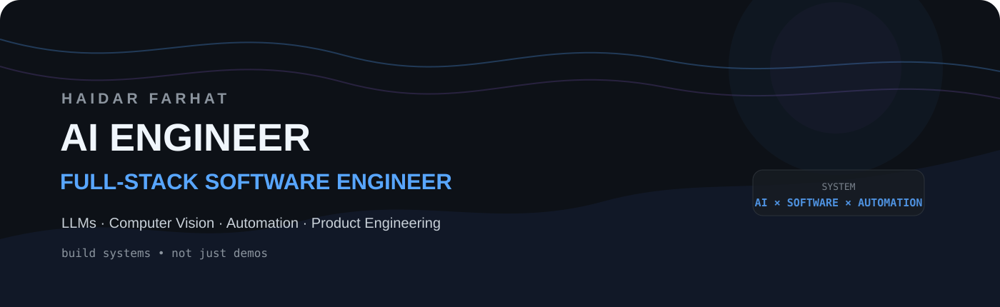

<div align="center">



<br />

<a href="https://github.com/haidar-farhat?tab=repositories"></a>
<a href="https://github.com/haidar-farhat"></a>
<a href="https://www.linkedin.com/"></a>

</div>

<br />

<table>
<tr>
<td width="55%" valign="top">

## `whoami`

I'm a **Computer Science graduate and software engineer** focused on **AI engineering, full-stack systems, computer vision, and automation**.

I like building the whole system — not only the model:

**idea → architecture → AI → backend → interface → automation → production**

My goal is to turn difficult workflows into software that is **useful, measurable, and reliable**.

</td>
<td width="45%" valign="top">

## `current_focus`

```text
AI Agents          ████████████████████
LLM Systems        ███████████████████░
Computer Vision    ██████████████████░░
Automation         ██████████████████░░
Full-Stack         ███████████████████░
Local AI           █████████████████░░░
```

</td>
</tr>
</table>

---

## 🧠 What I Build

<table>
<tr>
<td width="25%" valign="top">

### 🤖 AI

LLM applications

AI agents

RAG systems

Local GPU inference

Structured generation

</td>
<td width="25%" valign="top">

### 👁️ Vision

Detection

Segmentation

OCR

Image understanding

Camera analysis

Geometry

</td>
<td width="25%" valign="top">

### ⚙️ Automation

Browser control

Workflow engines

Data extraction

Agentic workflows

Execution monitoring

</td>
<td width="25%" valign="top">

### 🌐 Software

Web apps

APIs

Mobile apps

Databases

Product architecture


</td>
</tr>
</table>

---

# 🚀 Selected Builds

<table>
<tr>
<td width="50%" valign="top">

## 🤖 Jobbler

**AI-powered job workflow automation**

A product-oriented system exploring how AI can understand a user's profile, analyze opportunities, generate tailored application material, drive browser workflows, and track execution.

**AI · Agents · Browser Automation · LLMs · Web**

<a href="https://github.com/haidar-farhat/jobbler"></a>

</td>
<td width="50%" valign="top">

## 🧠 Brevet-GPT

**AI + document / knowledge workflow**

A project exploring language-model applications around documents, retrieval, and knowledge-oriented workflows.

**LLMs · RAG · Documents · AI**

<a href="https://github.com/haidar-farhat/Brevet-gpt"></a>

</td>
</tr>
<tr>
<td width="50%" valign="top">

## 💪 Silhou

**Fitness-focused mobile product**

A mobile/backend project combining product engineering, data workflows, and intelligent processing.

**React Native · TypeScript · Laravel**

</td>
<td width="50%" valign="top">

## 🧪 More in the Lab

Experiments and prototypes across:

**local AI · computer vision · OCR · ONNX · browser automation · full-stack systems · spatial computation**

The public repositories are the best view of what's actively being developed.

</td>
</tr>
</table>

---

## 🏗️ How I Think About AI Products


I care about what happens **after the demo works**: failure handling, observability, latency, data flow, maintainability, and whether the thing actually solves the original problem.

> **AI is the component. The product is the system.**

---

# 🛠️ Stack

### Core

<p>

</p>

### Frontend & Mobile

<p>

</p>

### Backend & Data

<p>

</p>

### AI / Vision / Systems

<p>

</p>

> **AI layer:** LLMs · RAG · agents · OCR · detection · segmentation · ONNX · local inference

---

# 📊 GitHub — At a Glance

<div align="center">


<br />


</div>

---

# 🐍 Contribution Activity

<div align="center">

</div>

---

# 🎓 Background

**B.S. Computer Science — Lebanese International University · 2025**

Software engineering experience spanning **full-stack application development, AI engineering, mobile development, and networking/security foundations**.

`CCNA` · `Cisco Network Security` · `CyberOps`

---

# 🔭 Now Exploring

<table>
<tr>
<td>🧠</td><td><b>Agentic systems</b><br />Tool use, orchestration, memory, evaluation</td>
<td>👁️</td><td><b>Vision intelligence</b><br />Camera understanding, segmentation, geometry</td>
</tr>
<tr>
<td>⚡</td><td><b>Local AI</b><br />Efficient inference on consumer GPUs</td>
<td>🌐</td><td><b>AI products</b><br />Reliable end-to-end applications</td>
</tr>
</table>

---

# 📬 Connect

<div align="center">

<a href="https://github.com/haidar-farhat"></a>
<a href="https://www.linkedin.com/"></a>

<br /><br />

<i>Building intelligent software that turns hard problems into working products.</i>

</div>

<!--
PROFILE REPO STRUCTURE
├── README.md
├── assets/
│   ├── hero.svg
│   ├── architecture.svg
│   └── contribution-snake-placeholder.svg
└── .github/
    └── workflows/
        └── snake.yml
-->
